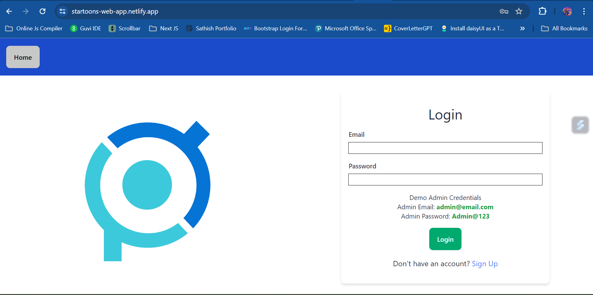

# Star Toons Web Application

This is the web application for Star Toons, a platform for managing users, visualizing user activity, and allowing users to change their passwords. Star Toons is built with a React frontend and a Node.js backend.

## Features

- **Authentication**: Users can sign up, log in, and change their passwords.
- **Dashboard**: Admins and regular users have different dashboards showing relevant information.
- **User Management**: Admins can view all users and their login activity.
- **Chart Visualization**: Users activity is visualized in a chart for easy understanding.
- **Responsive Design**: The application is designed to work well on both desktop and mobile devices.

## Demo

You can view a live demo of the application [here](https://startoons-web-app.netlify.app/).

## Backend

The backend of this application is built with Node.js and MongoDB. You can find the repository for the backend [here](link-to-backend-repository).

## Technologies Used

- React
- React Router
- Axios
- Chart.js
- Formik & Yup (for form handling and validation)
- Tailwind CSS (for styling)
- React Toastify (for notifications)

## Getting Started

To get a local copy up and running, follow these steps:

1. Clone the repository: `git clone <repository-url>`
2. Navigate to the project directory: `cd startoon-labs-web-fe`
3. Install dependencies: `npm install`
4. Start the development server: `npm run dev`

## API Documentation

You can find the API documentation [here](https://documenter.getpostman.com/view/28858691/2sA3Bhfuvq).

## Deployment

The frontend of this application is deployed on Netlify. You can find it [here](https://startoons-web-app.netlify.app/).

## Contributing

Contributions are welcome! Please create a new pull request for any changes you'd like to make.

## License

This project is licensed under the [MIT License](LICENSE).

## Acknowledgements

- Thanks to the creators of the libraries and frameworks used in this project.
- Special thanks to the Startoon Labs team for their support and guidance.
